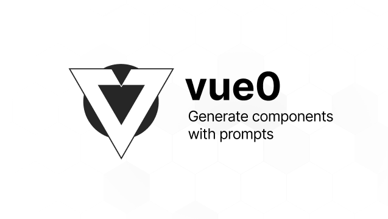

 

  

<h1 align="center">
vue0
</h1>

Vue version open source alternative for [v0](v0.dev).

## Contributing

We would love to have your contributions! All PRs all welcomed! We need help building the core components, docs, tests, stories! Join our discord and we will get you up and running!

## Dev Setup

### Docs

1. Clone the repo
2. Run `pnpm i`
3. Run `pnpm dev` to run Nuxt3
4. Open `http://localhost:3000`

## Credits

All credits go to these open-source works and resources

- [v0.dev](https://v0.dev)
- [openv0](https://github.com/raidendotai/openv0/)
- [Atinux's Todos Edge](https://github.com/Atinux/nuxt-todos-edge)
- [Nuxt SSE](https://gist.github.com/Atinux/05836469acca9649fa2b9e865df898a2)

Execution plan:
- [x] Generate metadata `json` for component
- [x] Write multi-pass step
- [x] Write iteration steps
- [x] Store components in fs
- [x] Render generated code
- [ ] Support image upload (https://platform.openai.com/docs/models/gpt-4-and-gpt-4-turbo)
- [x] Add user feature
- [x] Support fork components
- [x] Screen capture generated componet
- [x] Simple Meta
- [ ] Improve user feedback for iteration
- [ ] Allow local hosting without GitHub OAuth
- [x] Improve caching
